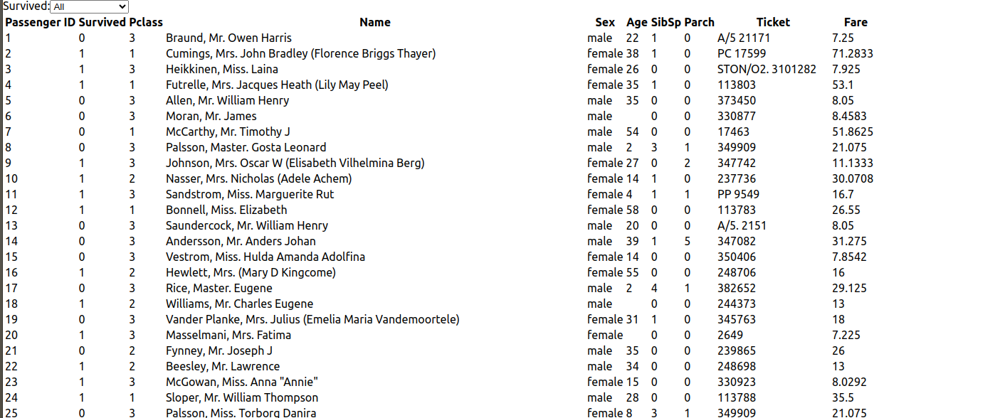
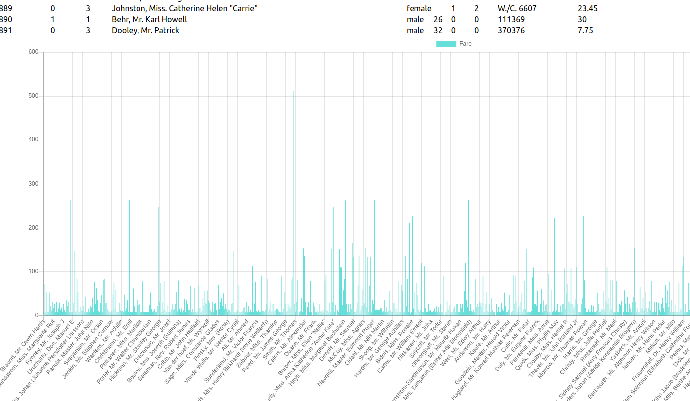
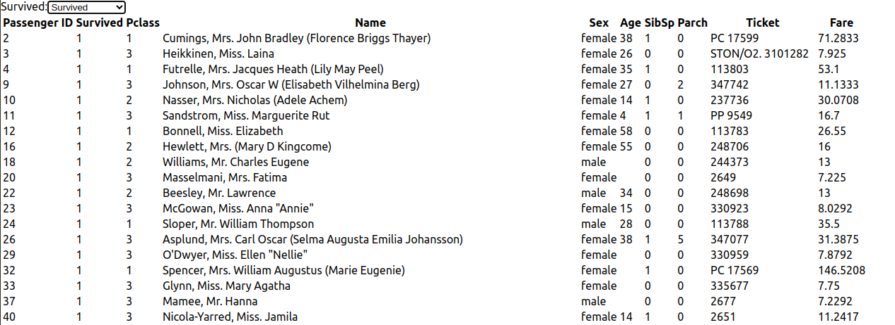
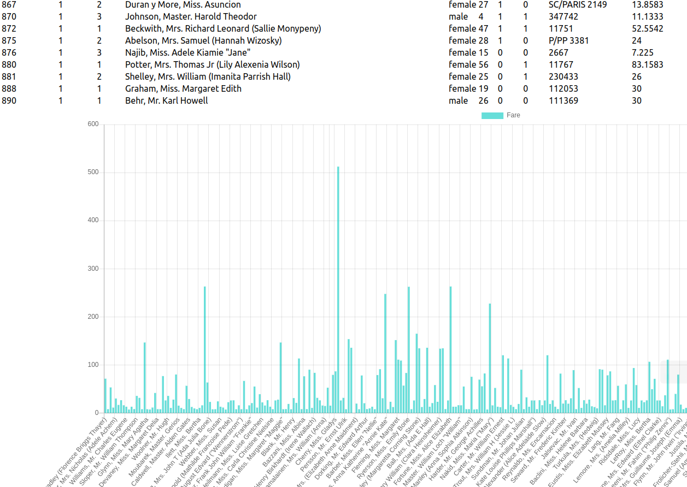
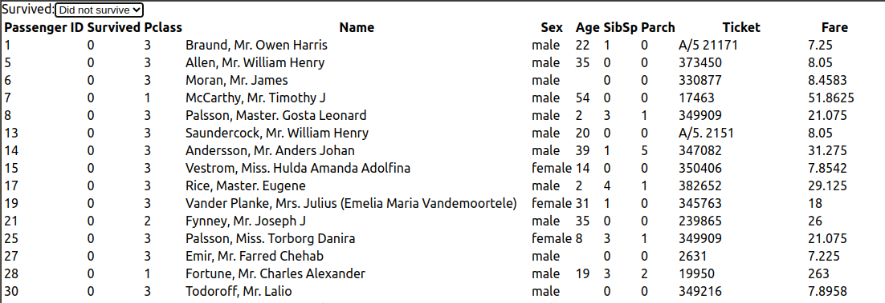
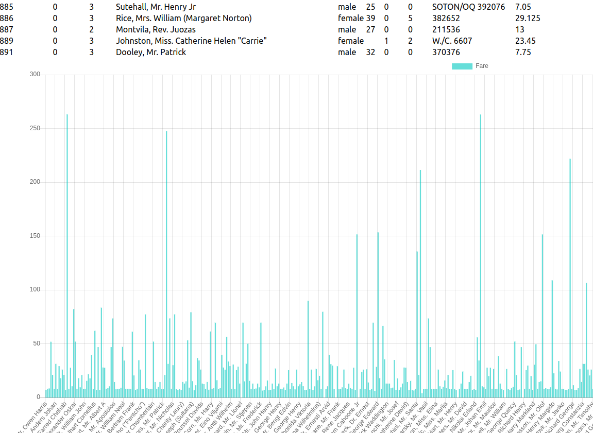
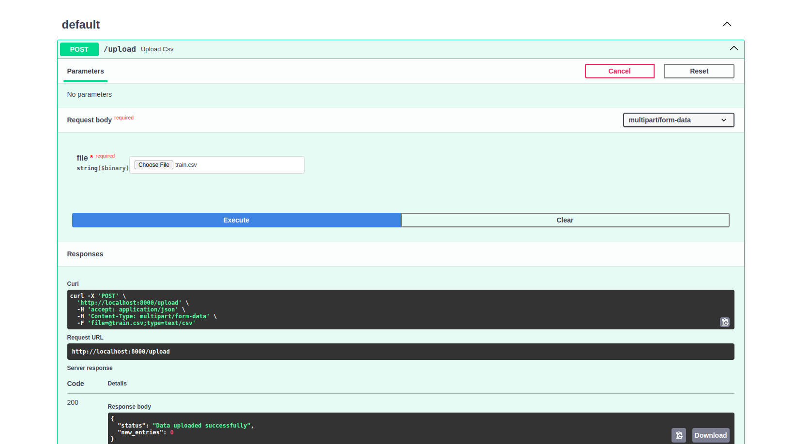
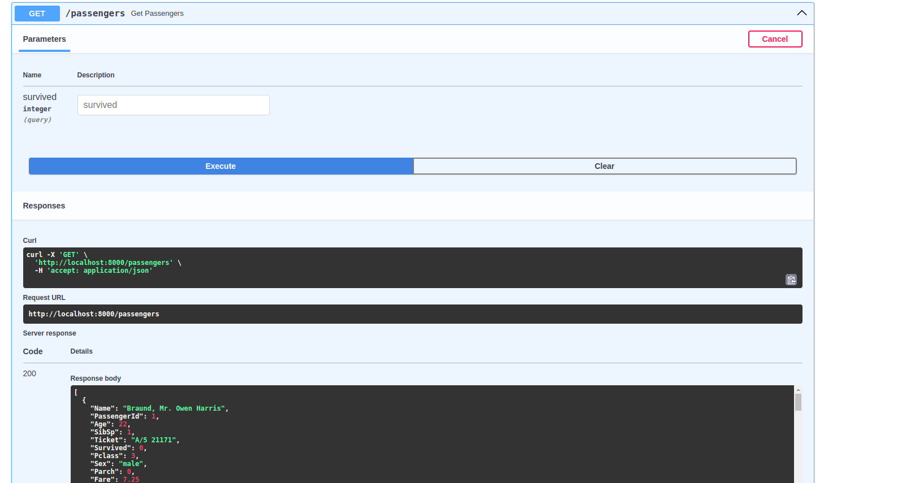
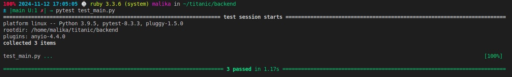

Pour FrontEnd: 
 Lance npm start 











# API d'Upload de Fichiers CSV et Gestion des Passagers

Cette API permet d'uploader des fichiers CSV, de les charger dans une base de données et de gérer les informations des passagers via des requêtes. Les données sont enregistrées dans une base de données relationnelle via SQLAlchemy.

## Routes disponibles

### 1. **`POST /upload`**
Cette route permet d'uploader un fichier CSV et de le sauvegarder dans le dossier `input`. Les données du fichier CSV sont ensuite lues et ajoutées à la base de données, en vérifiant les colonnes et en évitant les doublons.

#### Paramètres :
- **file** : Fichier CSV à uploader.

#### Fonctionnement :
- Le fichier CSV est téléchargé et sauvegardé dans le dossier `input`.
- Le fichier est ensuite analysé pour vérifier la présence de colonnes nécessaires, et les données sont insérées dans la base de données (en évitant les doublons basés sur `PassengerId`).

### 2. **`GET /load_csv`**
Cette route permet de charger les données depuis un fichier CSV appelé `train.csv`, présent dans le dossier `input`. Les données sont ensuite insérées dans la base de données, après avoir effectué les vérifications nécessaires.

#### Fonctionnement :
- Le fichier `train.csv` est chargé depuis le dossier `input`.
- Les données sont analysées, vérifiées pour les colonnes nécessaires et insérées dans la base de données.
- Si le fichier ou les colonnes sont manquants ou incorrects, une erreur est retournée.

### 3. **`GET /passengers`**
Cette route permet de récupérer la liste des passagers présents dans la base de données. Vous pouvez filtrer les passagers en fonction de leur statut de survie.

#### Paramètres :
- **survived** (facultatif) : Filtrer les passagers par leur statut de survie (`1` pour survécu, `0` pour non survécu).

#### Fonctionnement :
- La liste des passagers est retournée sous forme de JSON. Si un paramètre `survived` est fourni, les résultats sont filtrés en fonction de ce critère.

---

## Installation

1. Clonez ce repository dans votre environnement local :
   
   ```bash
   git clone https://github.com/nom-du-repository.git
   cd nom-du-repository
   ```

2. Créez un environnement virtuel et installez les dépendances :
   
   ```bash
   pip install -r requirements.txt
   ```


3. Lancez le serveur FastAPI :
   
   ```bash
   uvicorn app.main:app --reload
   ```

4. L'API sera accessible à l'adresse `http://localhost:8000`.

---

## Exemple d'utilisation

1. **Uploader un fichier CSV** via `/upload` :
   - Lancez une requête POST à `http://localhost:8000/upload` avec un fichier CSV. Vous pouvez utiliser un outil comme Postman ou cURL pour envoyer le fichier.
   
   Exemple avec `curl` :
   ```bash
   curl -X 'POST' 'http://localhost:8000/upload' -F 'file=@path/to/your/file.csv'
   ```

2. **Charger un fichier CSV depuis `train.csv`** via `/load_csv` :
   - Lancez une requête GET à `http://localhost:8000/load_csv` pour charger les données depuis le fichier `train.csv` dans le dossier `input`.

3. **Obtenir la liste des passagers** via `/passengers` :
   - Lancez une requête GET à `http://localhost:8000/passengers` pour récupérer tous les passagers.
   - Vous pouvez filtrer les passagers par statut de survie en ajoutant un paramètre `survived`, par exemple :
     - `http://localhost:8000/passengers?survived=1` pour les passagers survivants.

---

## Structure du projet

- **app/**
  - `main.py` : Le fichier contenant les routes de l'API.
  - `models.py` : Définition des modèles de base de données avec SQLAlchemy.
  - `database.py` : Gestion de la connexion à la base de données.
  - `input/` : Dossier où les fichiers CSV seront stockés.

- **requirements.txt** : Liste des dépendances nécessaires.






